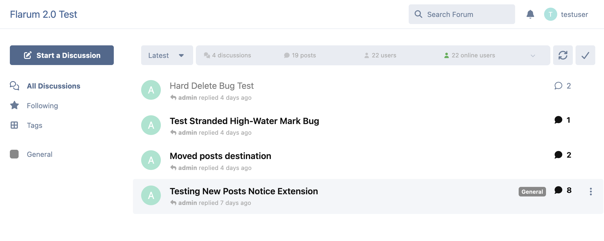
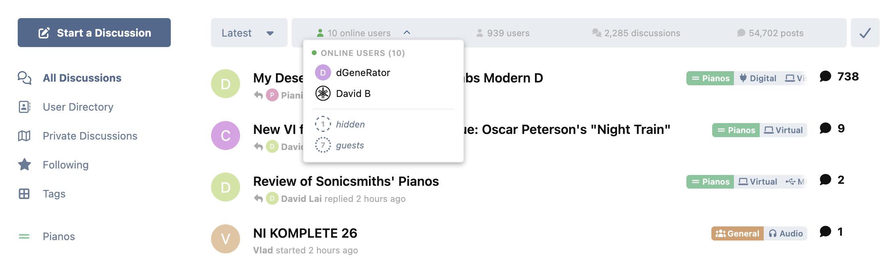
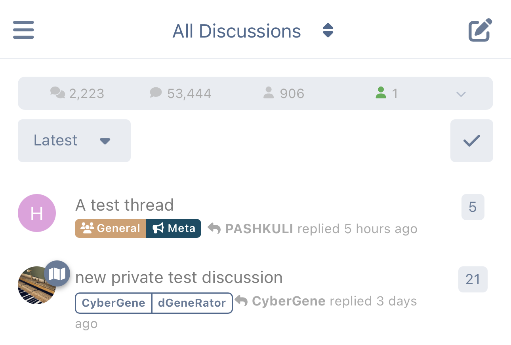
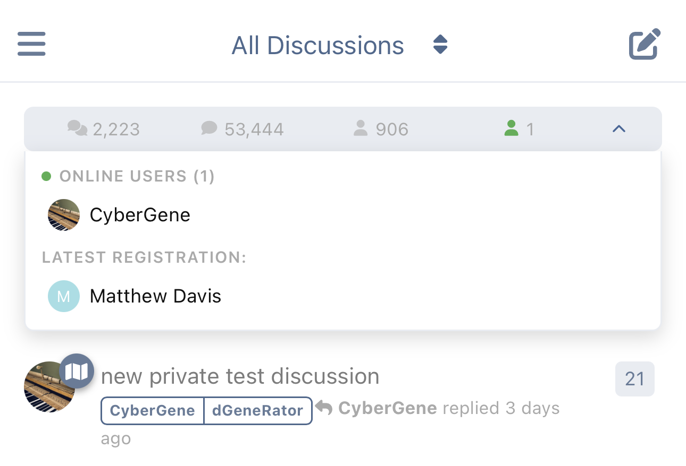
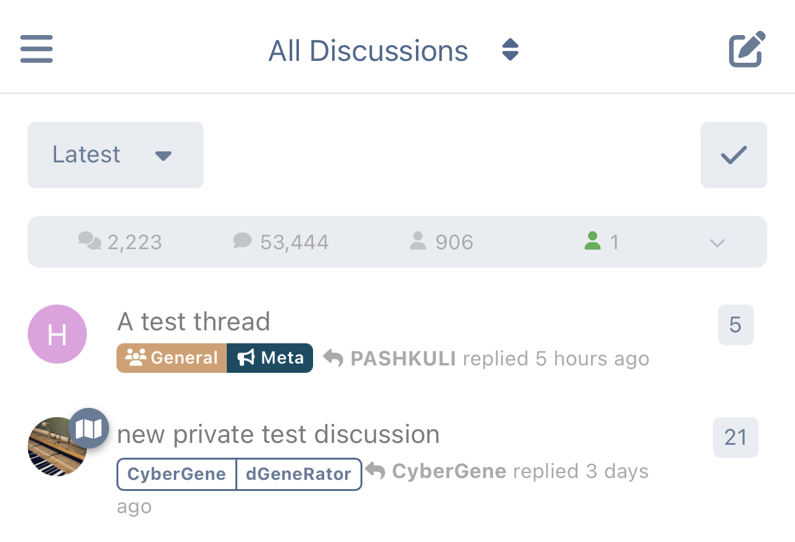
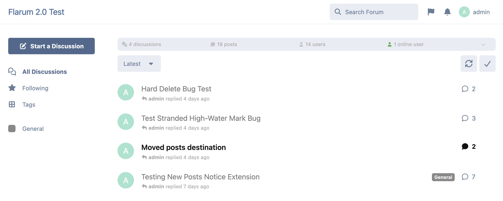
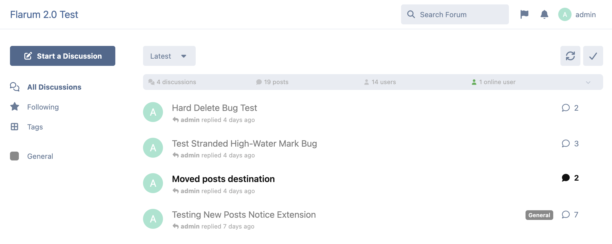
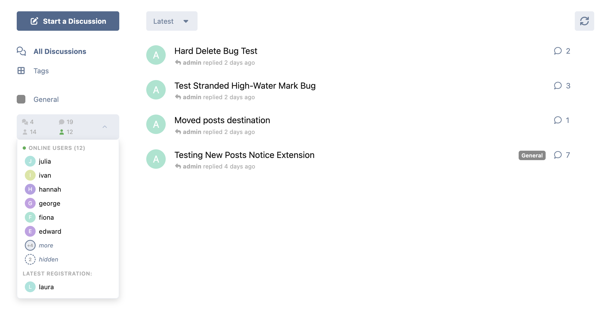

# Forum Stats Widget for Flarum 2.0

A compact widget that displays online users, forum statistics (discussions, posts, users), and the latest registration — with configurable layout options for both desktop and mobile.

## Screenshots

| Desktop — Inside toolbar (collapsed) | Desktop — Inside toolbar (expanded) |
|---|---|
|  |  |

| Mobile — Above toolbar (collapsed) | Mobile — Above toolbar (expanded) | Mobile — Below toolbar (collapsed) |
|---|---|---|
|  |  |  |

| Desktop — Above toolbar | Desktop — Below toolbar |
|---|---|
|  |  |

| Desktop — Classic sidebar | Desktop — Classic sidebar (expanded) |
|---|---|
|  |  |

## Features

- **Online Users** — Shows avatars of currently online users, sorted by most recently active. Users beyond the configurable maximum appear as a "+N more" indicator. Users who have hidden their online status are shown as a separate "hidden" count with a dashed circle.
- **Forum Statistics** — Displays discussion count, post count, and total user count with plural-aware labels.
- **Latest Registration** — Shows the most recently registered user with their avatar and display name.
- **Expandable Panel** — Compact stats bar with a click-to-expand panel for detailed information.
- **Live Updates** — Widget data auto-refreshes when you navigate back to the forum index (SPA navigation) or bring the browser tab back to the foreground. Combined with event-driven server cache invalidation on discussion / post / user events, stats stay fresh on every page return without a full reload. Desktop and mobile widget instances share one in-flight request, and actors without widget permissions skip the refetch entirely.
- **Configurable Layout** — Choose between a classic sidebar widget or a full-width bar above the discussion list. Full-width mode supports positioning above, inside, or below the toolbar on desktop.
- **Separate Desktop/Mobile Settings** — Independent bar position settings for desktop and mobile views.
- **Stat Toggles** — Each statistic (discussions, posts, users, latest registration) can be individually enabled or disabled from the admin panel.
- **Two-Tier Caching** — Separate caches for privileged users (admins/mods who can see hidden users) and regular users, each with its own configurable display limit. Zero database queries on cache hit.
- **Event-Driven Cache Invalidation** — Caches are automatically flushed when discussions, posts, or users are created or deleted.
- **Granular Permissions** — Each stat (online users, discussions, posts, users, latest registration) can be independently permission-gated. All default to visible for guests.
- **Accessible** — ARIA labels, roles, keyboard navigation, and screen reader support throughout.
- **Fully Localizable** — All strings use locale keys with ICU plural support.

## Requirements

- **Flarum 2.0** (not compatible with Flarum 1.x)
- **PHP 8.2+**

## Installation

```bash
composer require ekumanov/flarum-ext-forum-widgets
php flarum migrate
php flarum cache:clear
```

Then enable the extension in the admin panel under **Extensions > Forum Stats Widget**.

## Configuration

### Admin Settings

| Setting | Default | Description |
|---------|---------|-------------|
| Widget layout | Full width | Classic sidebar widget or full-width bar above discussions |
| Bar position (desktop) | Inside the toolbar | Where to place the bar relative to the toolbar (full-width only). Options: above, inside, or below |
| Bar position (mobile) | Above the toolbar | Where to place the bar on mobile. Options: above or below the toolbar |
| Widget sidebar position | -10 | Controls sidebar position; lower values = further down (classic layout only) |
| Show expand/collapse toggle button | Enabled | Show the chevron button that expands/collapses the details panel. When disabled, the panel is still reachable by clicking the bar (full-bar mode), the online users cell (online-cell and classic modes), or via keyboard on the online cell |
| Expanded panel width (desktop) | Online users cell only | In full-width desktop mode, where the expanded panel anchors. **Online users cell only**: panel drops below the online users count; clicking the online cell expands. **Full bar width**: panel spans the full bar; clicking anywhere on the bar expands |
| Show online users | Enabled | Master toggle for the online users feature |
| Maximum online users to display | 15 | Max avatars shown for regular users; overflow shown as "+N more" |
| Maximum online users to display (privileged) | 40 | Max avatars for users with "Always view user last seen time" permission |
| Last seen interval (minutes) | 5 | How many minutes since last activity to consider a user online |
| Online users cache duration (seconds) | 30 | How long to cache the online users list |
| Show discussions/posts/users/latest | All enabled | Individual toggles for each statistic |
| Statistics cache duration (seconds) | 600 | How long to cache discussion/post/user counts and latest registration |
| Ignore private discussions in count | Disabled | Exclude private discussions from the count |

### Permissions

All permissions default to **Everyone** (including guests):

- **View online users** — See the online users list and count
- **View discussions count** — See the discussions statistic
- **View posts count** — See the posts statistic
- **View users count** — See the users statistic
- **View latest registration** — See the latest registered user

### Caching

The extension maintains **two separate online user caches**:

1. **Privileged cache** — For users with the "Always view user last seen time" permission (typically admins and moderators). This cache includes users who have hidden their online status and uses the higher privileged display limit.
2. **Regular cache** — For all other users. Hidden users are excluded from this cache and shown only as a count.

Both caches default to a 30-second TTL. The forum statistics cache (discussions, posts, users, latest registration) has a separate 600-second TTL and is automatically invalidated when content is created or deleted.

## Updating

```bash
composer update ekumanov/flarum-ext-forum-widgets
php flarum migrate
php flarum cache:clear
```

## Links

- [Packagist](https://packagist.org/packages/ekumanov/flarum-ext-forum-widgets)
- [Discuss](https://discuss.flarum.org/d/38976-forum-stats-widget-with-online-users-too)
- [Report Issues](https://github.com/ekumanov/flarum-ext-forum-widgets/issues)

## License

MIT
