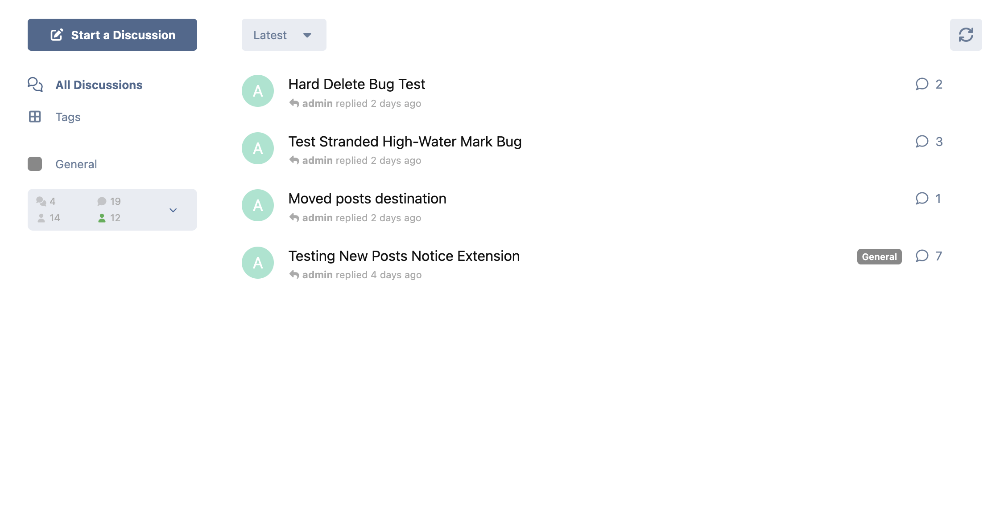
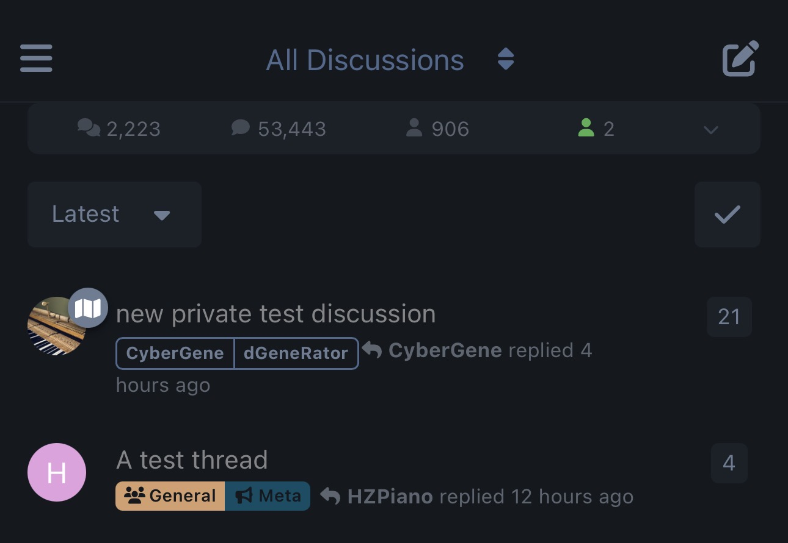

# Forum Stats Widget for Flarum 2.0

A compact sidebar widget that displays online users, forum statistics (discussions, posts, users), and the latest registration — all in a single, space-efficient widget.

## Screenshots

| Desktop (collapsed) | Desktop (expanded) |
|---|---|
|  |  |

| Mobile (collapsed) | Mobile (expanded) |
|---|---|
|  |  |

## Features

- **Online Users** — Shows avatars of currently online users, sorted by most recently active. Users beyond the configurable maximum appear as a "+N more" indicator. Users who have hidden their online status are shown as a separate "hidden" count with a dashed circle.
- **Forum Statistics** — Displays discussion count, post count, and total user count with icons and tooltips.
- **Latest Registration** — Shows the most recently registered user with their avatar and display name.
- **Expandable Panel** — Compact stats bar with a click-to-expand panel for detailed information.
- **Two-Tier Caching** — Separate caches for privileged users (admins/mods who can see hidden users) and regular users, each with its own configurable display limit. Zero database queries on cache hit.
- **Event-Driven Cache Invalidation** — Caches are automatically flushed when discussions, posts, or users are created or deleted.
- **Granular Permissions** — Each stat (online users, discussions, posts, users, latest registration) can be independently permission-gated. All default to visible for guests.
- **Configurable** — Widget sidebar position, cache durations, online interval, max display limits, and more — all from the admin panel.

## Requirements

- **Flarum 2.0** (not compatible with Flarum 1.x)
- **PHP 8.2+**

## Installation

```bash
composer require ekumanov/flarum-ext-forum-widgets
php flarum migrate
php flarum cache:clear
```

Then enable the extension in the admin panel under **Extensions > Forum Stats Widget**.

## Configuration

### Admin Settings

| Setting | Default | Description |
|---------|---------|-------------|
| Show online users | Enabled | Master toggle for the online users feature |
| Maximum online users to display | 15 | Max avatars shown for regular users; overflow shown as "+N more" |
| Maximum online users to display (privileged) | 40 | Max avatars for users with "Always view user last seen time" permission |
| Last seen interval (minutes) | 5 | How many minutes since last activity to consider a user online |
| Online users cache duration (seconds) | 30 | How long to cache the online users list |
| Statistics cache duration (seconds) | 600 | How long to cache discussion/post/user counts and latest registration |
| Ignore private discussions in count | Disabled | Exclude private discussions from the count |
| Widget sidebar position (priority) | -10 | Controls sidebar position; lower values = further down |

### Permissions

All permissions default to **Everyone** (including guests):

- **View online users** — See the online users list and count
- **View discussions count** — See the discussions statistic
- **View posts count** — See the posts statistic
- **View users count** — See the users statistic
- **View latest registration** — See the latest registered user

### Caching

The extension maintains **two separate online user caches**:

1. **Privileged cache** — For users with the "Always view user last seen time" permission (typically admins and moderators). This cache includes users who have hidden their online status and uses the higher privileged display limit.
2. **Regular cache** — For all other users. Hidden users are excluded from this cache and shown only as a count.

Both caches default to a 30-second TTL. The forum statistics cache (discussions, posts, users, latest registration) has a separate 600-second TTL and is automatically invalidated when content is created or deleted.

## Updating

```bash
composer update ekumanov/flarum-ext-forum-widgets
php flarum migrate
php flarum cache:clear
```

## Links

- [Packagist](https://packagist.org/packages/ekumanov/flarum-ext-forum-widgets)
- [Discuss](https://discuss.flarum.org/d/TODO)
- [Report Issues](https://github.com/ekumanov/flarum-ext-forum-widgets/issues)

## License

MIT
