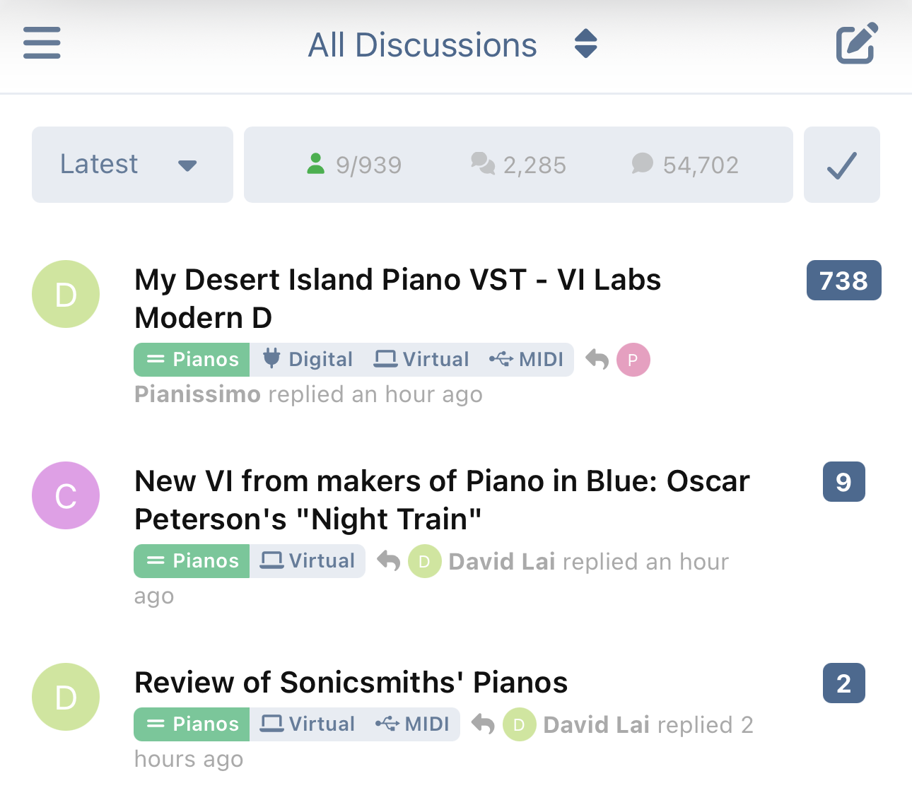
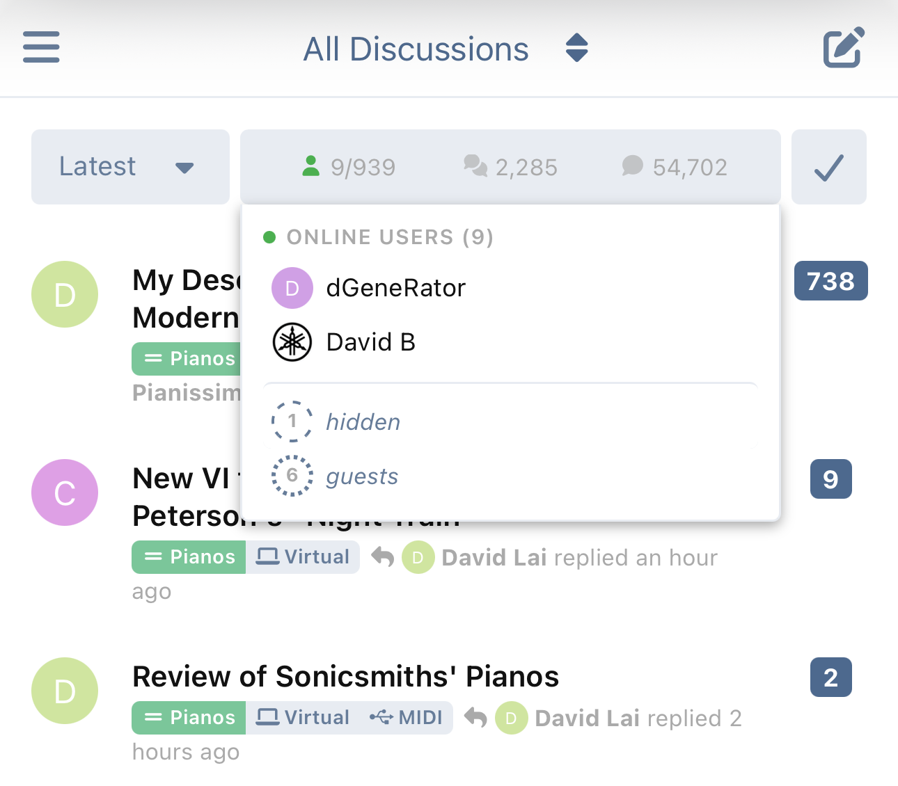

# Forum Stats Widget for Flarum 2.0

A compact widget that displays online users, forum statistics (discussions, posts, users), and the latest registration — with configurable layout options for both desktop and mobile.

## Screenshots

| Desktop — Collapsed | Desktop — Expanded |
|---|---|
|  |  |
| **Mobile — Collapsed** | **Mobile — Expanded** |
|  |  |

## Features

- **Online Users** — Shows avatars of currently online users, sorted by most recently active. The list is internally capped at 500 — high enough that real-world forums never hit it; if they do, the overflow renders as a "+N more" indicator. Users who have hidden their online status are shown as a separate "hidden" count with a dashed circle.
- **Online Guests** — Optional approximate count of unauthenticated visitors browsing the forum, shown as a separate row with a dotted circle below the hidden users. Each guest tab pings a small endpoint that records a hash of the visitor's IP and User-Agent into a short-lived presence map; the displayed count is the number of unique fingerprints seen within the "last seen interval". Counting is approximate by design — visitors behind a shared NAT collapse into one, mobile users on rotating IPs may be over-counted — and **no persistent identifier is stored on the visitor's browser**. The endpoint is rate-limited per IP, the in-memory map is hard-capped (oldest evicted on overflow), and the count can optionally be merged into the bar's main "online" number.
- **Forum Statistics** — Displays discussion count, post count, and total user count with plural-aware labels.
- **Latest Registration** — Shows the most recently registered user with their avatar and display name.
- **Expandable Panel** — Compact stats bar with a click-to-expand panel for detailed information.
- **Live Updates** — Widget data auto-refreshes when you navigate back to the forum index (SPA navigation) or bring the browser tab back to the foreground. Combined with event-driven server cache invalidation on discussion / post / user events, stats stay fresh on every page return without a full reload. Desktop and mobile widget instances share one in-flight request, and actors without widget permissions skip the refetch entirely.
- **Presence Heartbeat** — Logged-in users with a focused tab send a small background ping every minute so the online indicator stays accurate even while they read or compose a long reply via the realtime extension without navigating. On the forum index the same ping doubles as a widget refresh (sparse fields, ~500 bytes per ping), so the online users list and stats keep themselves current — near-realtime, no navigation needed. Off the index it's a 92-byte sparse ping. Throttled to one DB write per 3 minutes per user, skipped when the tab is hidden or the user is a guest, and disable-able from admin.
- **Configurable Layout** — Choose between a classic sidebar widget or a full-width bar above the discussion list. Full-width mode supports positioning above, inside, or below the toolbar on desktop.
- **Separate Desktop/Mobile Settings** — Independent bar position settings for desktop and mobile views.
- **Stat Toggles** — Each statistic (discussions, posts, users, latest registration) can be individually enabled or disabled from the admin panel.
- **Two-Tier Caching** — Separate caches for privileged users (admins/mods who can see hidden users) and regular users — same display cap, different result sets. Zero database queries on cache hit.
- **Event-Driven Cache Invalidation** — Caches are automatically flushed when discussions, posts, or users are created or deleted.
- **Granular Permissions** — Each stat (online users, discussions, posts, users, latest registration) can be independently permission-gated. All default to visible for guests.
- **Accessible** — ARIA labels and roles throughout, screen-reader-friendly counts (e.g. the guest badge announces as "12,345 guests" rather than relying on the visual dotted-vs-dashed distinction), section headings exposed via `role="heading"` for H-key navigation, full keyboard support (Tab to the toggle, Enter to expand, Tab through the panel, Escape to close and return focus to the toggle), and elastic count badges that gracefully degrade to a pill shape for large numbers without overflowing.
- **Fully Localizable** — Every user-facing string flows through locale keys with ICU plural support; no hardcoded English. Translators can add a language by dropping a YAML file alongside `locale/en.yml`.

## Requirements

- **Flarum 2.0** (not compatible with Flarum 1.x)
- **PHP 8.2+**

## Installation

```bash
composer require ekumanov/flarum-ext-forum-widgets
```

Then enable the extension in the admin panel under **Extensions > Forum Stats Widget**. Enabling runs the extension's migration and recompiles the frontend assets automatically — no extra `php flarum` commands are needed for a normal install.

## Configuration

### Admin Settings

| Setting | Default | Description |
|---------|---------|-------------|
| Widget layout | Full width | Classic sidebar widget or full-width bar above discussions |
| Bar position (desktop) | Inside the toolbar | Where to place the bar relative to the toolbar (full-width only). Options: above, inside, or below |
| Bar position (mobile) | Inside the toolbar | Where to place the bar on mobile. Options: above, inside, or below the toolbar |
| Widget sidebar position | -10 | Controls sidebar position; lower values = further down (classic layout only) |
| Show expand/collapse toggle button | Enabled | Show the chevron button that expands/collapses the details panel. When disabled, the panel is still reachable by clicking the bar (full-bar mode), the online users cell (online-cell and classic modes), or via keyboard on the online cell |
| Expanded panel width (desktop) | Online users cell only | In full-width desktop mode, where the expanded panel anchors. **Online users cell only**: panel drops below the online users count; clicking the online cell expands. **Full bar width**: panel spans the full bar; clicking anywhere on the bar expands |
| Show online users | Enabled | Master toggle for the online users feature |
| Last seen interval (minutes) | 5 | How many minutes since last activity to consider a user online (paired with the presence heartbeat default) |
| Online users cache duration (seconds) | 30 | How long to cache the online users list |
| Enable presence heartbeat | Enabled | Whether logged-in users with a focused tab send a background ping every minute to keep their last-seen timestamp fresh (and on the forum index, also auto-refresh the widget data). Disable for zero background traffic |
| Show online guests | Enabled | Master toggle for guest counting. When on, each guest tab pings a small unauthenticated endpoint and the resulting count appears in the expanded panel as a dotted circle. Disabled when **Show online users** is off |
| Include guests in main online count | Enabled | When on, the bar (and panel section header) sums logged-in members and guests; the breakdown rows still list each component separately. Disabled when either **Show online users** or **Show online guests** is off |
| Show discussions/posts/users/latest | All enabled | Individual toggles for each statistic |
| Statistics cache duration (seconds) | 600 | How long to cache discussion/post/user counts and latest registration |
| Ignore private discussions in count | Disabled | Exclude private discussions from the count |

### Permissions

All permissions default to **Everyone** (including guests):

- **View online users** — See the online users list and count. Also gates the online guests row when guest counting is enabled.
- **View discussions count** — See the discussions statistic
- **View posts count** — See the posts statistic
- **View users count** — See the users statistic
- **View latest registration** — See the latest registered user

### Caching

The extension maintains **two separate online user caches**:

1. **Privileged cache** — For users with the "Always view user last seen time" permission (typically admins and moderators). Includes users who have hidden their online status.
2. **Regular cache** — For all other users. Hidden users are excluded and shown only as a count.

Both caches share a hardcoded ceiling of 500 entries — well above what any real forum sees concurrently. Beyond that the panel falls back to a "+N more" overflow row.

Both caches default to a 30-second TTL. The forum statistics cache (discussions, posts, users, latest registration) has a separate 600-second TTL and is automatically invalidated when content is created or deleted.

## Updating

```bash
composer update ekumanov/flarum-ext-forum-widgets
```

Then hard-refresh the forum in your browser (Cmd+Shift+R on macOS, Ctrl+Shift+R on Windows/Linux) so it picks up the new CSS/JS.

This extension ships only its compiled JS/CSS bundles via `Extend\Frontend` — there are no static public assets (fonts, images) to republish, so `php flarum assets:publish` is **not** required for installs or updates of this extension. Flarum recompiles the asset bundles on enable/update automatically. (`assets:publish` is only relevant after a Flarum **core** upgrade that changes its own shipped assets, e.g. the FontAwesome 7 font swap in Flarum 2.0 beta 8.)

If the new version still doesn't appear:

- Confirm the new version is installed: `composer show ekumanov/flarum-ext-forum-widgets | grep versions`
- Check the served cache-buster hash changed: `curl -s https://your-forum/ | grep -oE 'forum\.css\?v=[a-f0-9]+'` — the hash should differ from before the update.
- If you're behind a CDN (e.g. Cloudflare) and the hash changed but you still see old bytes, purge that URL in your CDN.

## Links

- [Packagist](https://packagist.org/packages/ekumanov/flarum-ext-forum-widgets)
- [Discuss](https://discuss.flarum.org/d/38976-forum-stats-widget-with-online-users-too)
- [Report Issues](https://github.com/ekumanov/flarum-ext-forum-widgets/issues)

## License

MIT
